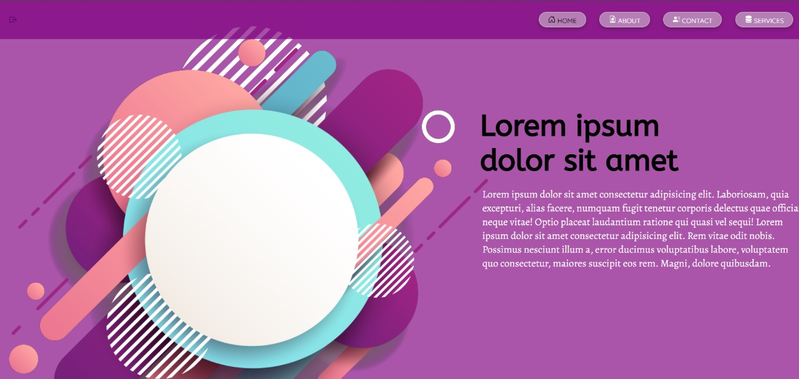

# 🌐 Modern Static Website — *Responsive, Fast & Clean*

  

---

## ✨ Overview

A modern, fully responsive **static website** built using pure **HTML5**, **CSS3**, and **Bootstrap 5** — designed with mobile-first principles and clean UI aesthetics.

Perfect for landing pages, portfolios, or small business sites.

---

## 🚀 Features

✅ 100% Static — No JS needed  
✅ Fully **Responsive Design**  
✅ Built with **Bootstrap 5 Grid**  
✅ **Smooth Animations** using only CSS  
✅ **Cross-Browser Compatibility**  
✅ Mobile, tablet, and desktop optimized

---

## 🛠️ Tech Stack

| Technology    | Purpose                     |
|---------------|-----------------------------|
| HTML5         | Semantic page structure     |
| CSS3          | Styling & animations         |
| Bootstrap 5   | Layout & responsive design   |
| Font Awesome  | Scalable vector icons        |

---

